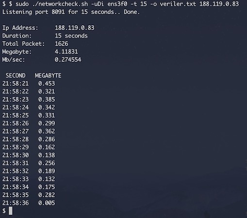

# NetworkCheck 
tcpdump and shell practice.

## Usage
git clone https://github.com/canberk/network-check.git && cd network-check && chmod +x networkcheck.sh && sudo ./networkcheck.sh

Usage networkcheck.sh [-duD] [-i INTERFACE] [-p PORT] [-t SECONDS] [-o OUTPUT FILE] [IP_ADDRESS]
 
 \-i Listen specific interface.

 \-p Listen specific port.
 
 \-t Listen duration. 
 
 \-o Output mode. Records file output data.
 
 \-d Download mode. Calculate the download data.
 
 \-u Upload mode. Calculate the upload data.
 
 \-D Detail mode. Detail output data.
 
 \-h Information about this script.
   
## Output
